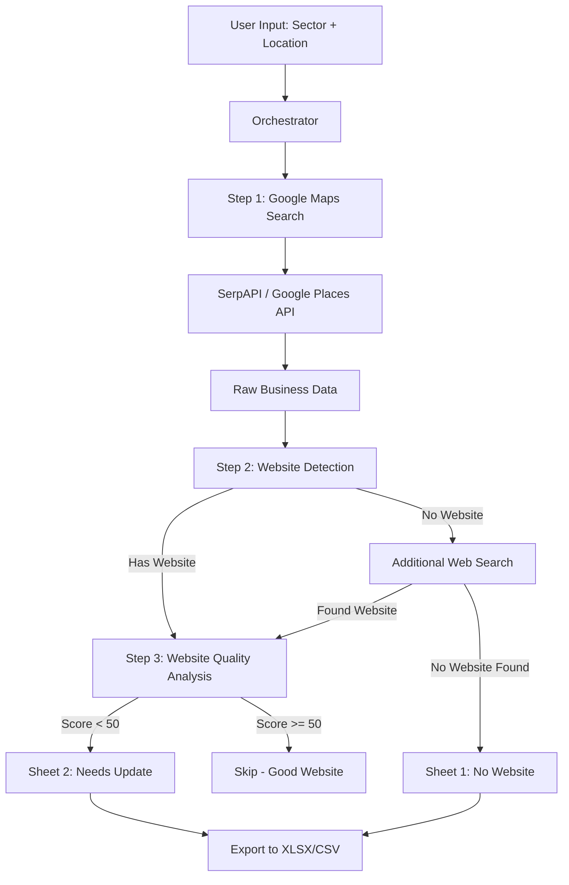

# Google Maps Lead Scraper & Website Quality Analyzer — Architecture Proposal

This document is the **Phase 1 Architecture Proposal** as required by [instructions.md](file:///home/trizzi/Desktop/Scraping_antigravity/instructions.md). No code will be written until you approve this plan.

---

## User Review Required

> [!IMPORTANT]
> **API Key Decisions**: The scraping strategy depends on which APIs you have access to (or are willing to sign up for). Please confirm your preferences in the Open Questions section below.

> [!WARNING]
> **Cost Implications**: Some options (Google Places API, SerpAPI paid plans) involve recurring costs. The plan below includes a free-tier-friendly path, but scaling will require paid API access.

---

## Open Questions

### 1. Which Google Maps data source do you prefer?

| Option | Free Tier | Cost at Scale | Reliability | Setup Effort |
|---|---|---|---|---|
| **A. SerpAPI** | 250 searches/month free | $75/mo for 5,000 searches | ⭐⭐⭐⭐⭐ Handles anti-bot | Low (API key only) |
| **B. Google Places API (New)** | Free monthly cap (limited) | ~$17–$40 per 1,000 requests | ⭐⭐⭐⭐⭐ Official API | Medium (GCP project) |
| **C. Playwright browser scraping** | Completely free | Free (infrastructure only) | ⭐⭐ Anti-bot risk | High (stealth config) |

**My recommendation**: **Option A (SerpAPI)** for the MVP. It provides the best reliability-to-effort ratio, has a usable free tier (250 searches/month), returns structured JSON, and handles pagination. We can add Option B as a secondary source later.

> [!IMPORTANT]
> Do you already have a SerpAPI key or Google Cloud API key? If neither, which would you prefer to set up?

### 2. Website quality analysis approach?

| Option | Cost | Speed | Accuracy | Dependencies |
|---|---|---|---|---|
| **A. Playwright heuristic checks only** | Free | Fast (~3s/site) | ⭐⭐⭐ Good for visual/structural | Python + Playwright |
| **B. Google PageSpeed Insights API only** | Free (unlimited) | Medium (~10s/site) | ⭐⭐⭐⭐ Performance + SEO + a11y | API key (free) |
| **C. Hybrid: Playwright + PageSpeed** | Free | Medium (~12s/site) | ⭐⭐⭐⭐⭐ Most comprehensive | Both |

**My recommendation**: **Option C (Hybrid)**. Playwright catches visual/structural issues (broken layout, missing hamburger menu, viewport problems) that PageSpeed misses, while PageSpeed provides objective performance, SEO, and accessibility scores. Together they cover all criteria from the spec.

### 3. Geographic scope for MVP testing?

The spec defaults to Stockholm, Sweden. Should I:
- **(a)** Start with Stockholm only for MVP testing?
- **(b)** Start with a smaller test area (e.g., a specific Stockholm district) to conserve API calls?

### 4. Output format preference?

The spec mentions CSV, XLSX, and Google Sheets. For MVP:
- **(a)** CSV + XLSX (local files, no auth needed) — **recommended for MVP**
- **(b)** Google Sheets (requires OAuth setup with `credentials.json`)
- **(c)** Both

---

## Proposed Architecture

### System Overview



### 3-Layer Architecture Mapping

Following the [General_Agent.md](file:///home/trizzi/Desktop/Scraping_antigravity/General_Agent.md) pattern:

```
Scraping_antigravity/
├── directives/                          # Layer 1: SOPs
│   ├── scrape_google_maps.md            # How to search & collect businesses
│   ├── detect_website.md                # How to determine if website exists
│   ├── analyze_website_quality.md       # How to score websites
│   └── export_results.md               # How to generate spreadsheets
│
├── execution/                           # Layer 3: Deterministic scripts
│   ├── scrape_google_maps.py            # SerpAPI/Places API integration
│   ├── detect_website.py               # Website existence checker
│   ├── analyze_website_quality.py       # Playwright + PageSpeed scoring
│   ├── export_spreadsheet.py           # XLSX/CSV generation
│   └── utils/
│       ├── config.py                    # Configuration loader
│       ├── logger.py                    # Structured logging
│       └── rate_limiter.py             # Rate limiting & retry logic
│
├── .tmp/                                # Intermediate data (gitignored)
│   ├── raw_businesses.json              # Raw scraped data
│   ├── enriched_businesses.json         # After website detection
│   └── scored_businesses.json           # After quality analysis
│
├── output/                              # Final deliverables
│   ├── leads_YYYY-MM-DD.xlsx            # Excel output
│   └── leads_YYYY-MM-DD.csv            # CSV output
│
├── .env                                 # API keys (gitignored)
├── requirements.txt                     # Python dependencies
├── .gitignore
├── General_Agent.md                     # Agent behavior instructions
└── instructions.md                      # Project specification
```

---

## Detailed Technical Decisions

### 1. Data Collection — Google Maps Search

**Chosen approach: SerpAPI** (pending your approval)

**How it works:**
- SerpAPI's `google_maps` engine returns structured JSON for a search query + location
- Each search returns up to 20 results; pagination is handled via a `start` parameter
- Google Maps itself caps visible results at ~120 per query
- To get more coverage, we split broad areas into sub-regions (e.g., Stockholm districts)

**Key fields we extract per result:**
```python
{
    "name": "Business Name",
    "place_id": "ChIJ...",
    "address": "Full address",
    "phone": "+46...",
    "website": "https://...",
    "rating": 4.5,
    "reviews": 127,
    "type": "electrician",
    "gps_coordinates": {"lat": 59.33, "lng": 18.07},
    "google_maps_url": "https://maps.google.com/..."
}
```

**Rate limiting strategy:**
- Free tier: 50 searches/hour → we add 75-second delays between requests
- Implement exponential backoff on failures
- Cache results in `.tmp/raw_businesses.json` so we never re-fetch

---

### 2. Website Detection (Step 2)

For businesses without a listed website:

1. **Primary check**: `website` field from Google Maps data
2. **Fallback search**: Use SerpAPI's `google` engine to search `"Business Name" + "city" + "website"`
3. **Domain validation**: HEAD request to verify the URL actually responds (handle redirects, timeouts)
4. **Classification**:
   - Valid website found → proceed to quality analysis
   - No website found → mark as "No Website" lead

---

### 3. Website Quality Scoring System

> [!NOTE]
> The instructions require that I explain and justify the scoring methodology before implementation. Here is the proposed system.

**Composite score: 0–100**, calculated from 7 weighted dimensions:

| Dimension | Weight | Method | What It Catches |
|---|---|---|---|
| **Mobile Responsiveness** | 20% | Playwright viewport emulation (375px vs 1280px) | Layout breaks, missing hamburger menus, horizontal scroll |
| **Performance** | 15% | PageSpeed Insights API — Performance score | Slow loading, large images, render-blocking resources |
| **SSL/HTTPS** | 10% | URL scheme check + certificate validation | Missing SSL, expired certificates |
| **SEO Basics** | 15% | PageSpeed SEO audit + HTML checks | Missing title, meta description, h1, alt text |
| **Accessibility** | 10% | PageSpeed Accessibility audit | Color contrast, missing labels, keyboard nav |
| **Modern Design Signals** | 15% | Playwright heuristic checks | Old typography (Times New Roman), table-based layouts, Flash references, missing viewport meta |
| **Functional Checks** | 15% | Playwright + requests | Broken links (sample), missing sitemap.xml, missing favicon, dead contact forms |

**Scoring logic:**
```
final_score = Σ (dimension_score × weight)

If final_score >= 50 → "Good website" → SKIP (not a lead)
If final_score < 50  → "Needs update" → SAVE as lead
If final_score < 25  → "Critical" → High-priority lead
```

**Modern Design Signal heuristics (Playwright checks):**
- Viewport meta tag present?
- Uses web fonts (not just system fonts)?
- CSS flexbox/grid detected (vs table-based layouts)?
- No Flash/Silverlight references?
- No `<marquee>`, `<blink>`, or `<center>` tags?
- Copyright year is within last 2 years?
- Has `<meta name="viewport">` tag?

> [!IMPORTANT]
> Does this scoring breakdown look reasonable to you? Would you like to adjust any weights or add/remove criteria?

---

### 4. Data Storage

**Intermediate storage**: JSON files in `.tmp/` — simple, inspectable, regenerable.

**Final output**: `openpyxl` for XLSX generation with two sheets:
- **Sheet 1**: "Businesses Without Website"
- **Sheet 2**: "Websites To Be Updated"

Both sheets will have formatted headers, auto-width columns, and conditional formatting (e.g., red for score < 25, orange for score < 50).

---

### 5. Concurrency Model

**Sequential with delays** for the MVP:
- One request at a time to avoid rate limits
- Configurable delay between requests (default: 2 seconds)
- All intermediate results cached to `.tmp/` after each step

**Why not parallel?** The free tier of SerpAPI is 50 req/hour. Parallelism would burn through the limit instantly with no speed benefit. We can add concurrency in Phase 4 when on a paid plan.

---

### 6. Error Handling & Resilience

- **Checkpoint system**: After each business is processed, results are written to `.tmp/`. If the script crashes, it resumes from the last checkpoint.
- **Retry with backoff**: 3 retries with exponential backoff (2s, 4s, 8s) for transient failures.
- **Graceful degradation**: If PageSpeed API fails for a site, score is computed from Playwright checks only (partial score).
- **Structured logging**: All events logged to `logs/scraper_YYYY-MM-DD.log` with levels (INFO, WARNING, ERROR).

---

### 7. Technology Stack Summary

| Component | Technology | Justification |
|---|---|---|
| Language | Python 3.11+ | Spec preference, best scraping ecosystem |
| Google Maps data | SerpAPI | Reliable, structured, free tier available |
| Website analysis | Playwright (Python) | Device emulation, JS rendering, heuristic checks |
| Performance scoring | PageSpeed Insights API | Free, objective, industry-standard metrics |
| Spreadsheet export | openpyxl + csv stdlib | XLSX with formatting + CSV fallback |
| HTTP client | httpx | Async-ready, modern, timeout handling |
| Config management | python-dotenv | Load `.env` for API keys |
| Logging | Python `logging` stdlib | Structured, configurable levels |
| Rate limiting | Custom (token bucket) | Simple, no external dependencies |

---

## Dependencies (`requirements.txt`)

```
serpapi>=2.0.0
playwright>=1.40.0
httpx>=0.25.0
openpyxl>=3.1.0
python-dotenv>=1.0.0
```

---

## Implementation Roadmap

### Phase 2 — MVP (first to build after approval)
1. Project scaffolding (directories, `.env`, config, logging)
2. `scrape_google_maps.py` — SerpAPI integration with pagination
3. `detect_website.py` — Website existence checker
4. `export_spreadsheet.py` — XLSX/CSV generation
5. Directives for each step
6. End-to-end test with a small sector/area

### Phase 3 — Website Quality Analysis
1. `analyze_website_quality.py` — Playwright checks
2. PageSpeed Insights API integration
3. Scoring engine with weighted dimensions
4. Integration into the pipeline
5. Updated export with quality scores

### Phase 4 — Scaling (future)
- Multi-city support with sub-region splitting
- Parallel scraping with worker pools
- Google Sheets export (OAuth)
- Cloud deployment options

---

## Verification Plan

### Automated Tests
- Unit tests for scoring logic (known good/bad site inputs → expected scores)
- Integration test: run full pipeline for "electricians in Stockholm" (limited to 5 results)
- Validate XLSX output structure against spec

### Manual Verification
- Spot-check 10 businesses: verify scraped data matches Google Maps
- Manually visit 5 "bad score" websites to confirm the scoring is reasonable
- Open XLSX in Excel/Google Sheets to verify formatting
